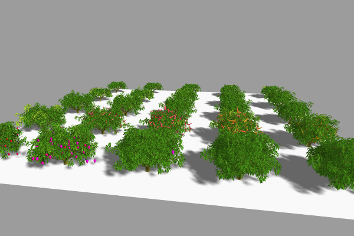
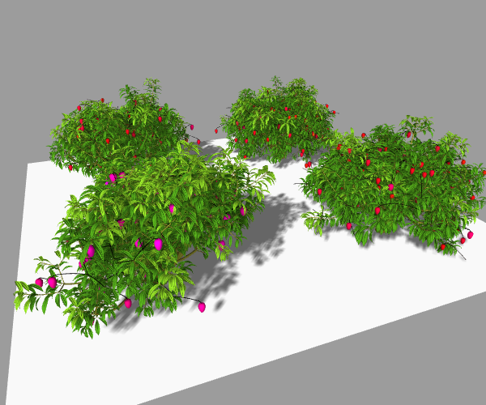
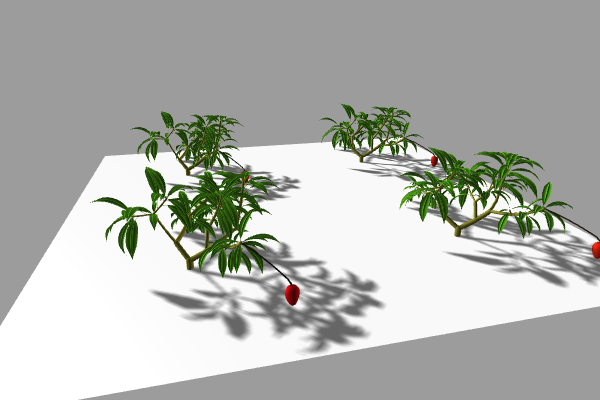

## Demo notebooks for vmango-lab

A demo repository for [vmango-lab](https://github.com/jvail/vmango-lab)

### Setup a conda environment and run locally

```bash
conda env create -f environment.yml
```

```bash
conda activate vmango-lab
jupyter notebook
```

### Run interactively on binder

 [](https://mybinder.org/v2/gh/jvail/vmango-lab-demo/main)

### View on nbviewer

Modularity [@nbviewer](https://nbviewer.jupyter.org/github/jvail/vmango-lab-demo/blob/main/notebooks/1-modularity.ipynb)


Mango Cycles [@nbviewer](https://nbviewer.jupyter.org/github/jvail/vmango-lab-demo/blob/main/notebooks/2-mango_cycles.ipynb)



Orchard [@nbviewer](https://nbviewer.jupyter.org/github/jvail/vmango-lab-demo/blob/main/notebooks/3-orchard_parallelization.ipynb)



Use Case [@nbviewer](https://nbviewer.jupyter.org/github/jvail/vmango-lab-demo/blob/main/notebooks/4-use_case_measure_and_simulate.ipynb)


