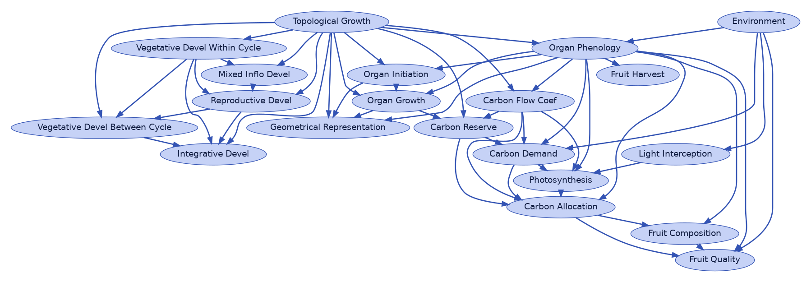
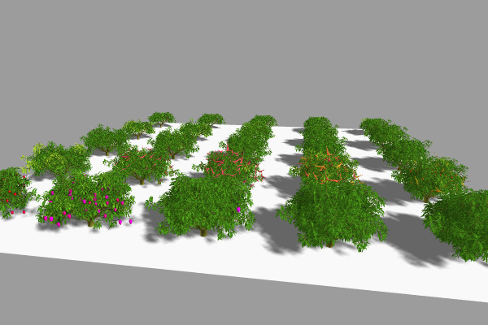
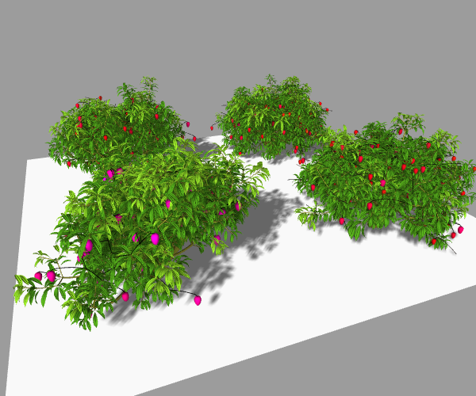
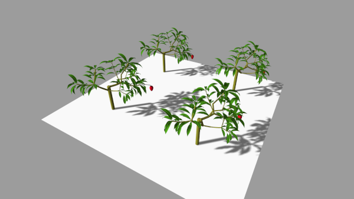

# Demo notebooks for [vmango-lab](https://github.com/jvail/vmango-lab)

View on nbviewer, run and inspect interactively on binder or run it locally after setting up the conda environment.


## Run on binder [](https://mybinder.org/v2/gh/jvail/vmango-lab-demo/main?urlpath=lab/tree/notebooks)


## View on nbviewer

### Modularity [1.0 @nbviewer](https://nbviewer.org/github/jvail/vmango-lab-demo/blob/a004cfc33b1665cce14f8531160246100651110d/notebooks/1-0-modularity.ipynb) and [1.1 @nbviewer](http://nbviewer.ipython.org/github/jvail/vmango-lab-demo/blob/a004cfc33b1665cce14f8531160246100651110d/notebooks/1-1-arch_dev.ipynb)

Visualizing a model's processes and their dependencies and replace, plug-in and unplug a custom processes.



### Mango Cycles [@nbviewer](https://nbviewer.jupyter.org/github/jvail/vmango-lab-demo/blob/main/notebooks/2-mango_cycles.ipynb)

A simulation and visualization of a mango tree through two vegetative cycles.



### A Mango Orchard [@nbviewer](https://nbviewer.jupyter.org/github/jvail/vmango-lab-demo/blob/main/notebooks/3-orchard_parallelization.ipynb)

Simulation of a mango orchard with multi-model parallelization.



### A Use Case [@nbviewer](https://nbviewer.jupyter.org/github/jvail/vmango-lab-demo/blob/main/notebooks/4-use_case_measure_and_simulate.ipynb)

A use case from measurements in the field, data preparation to simulation.




## Setup a conda environment and run locally

Requires a [minicoda](https://docs.conda.io/en/latest/miniconda.html) installation and the conda executable needs to be available in PATH.

```bash
git clone https://github.com/jvail/vmango-lab-demo.git
```

```bash
cd vmango-lab-demo
conda env create -f environment.yml
```

```bash
conda activate vmango-lab-demo
jupyter notebook
```
